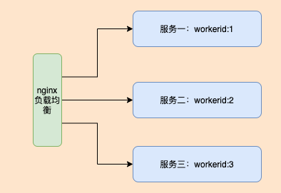

# uuid

#### 介绍

雪花算法，生成uuid，golang语言

#### 软件架构


#### 集群部署

###### nginx负载均衡配置
```
        在nginx的配置文件(nginx.config)添加如下代码:
        upstream go_uuid_cluster {
                server 127.0.0.1:prot;  # 服务一： 具体集群个服务器的ip地址和uuid服务启动的端口号
                server 127.0.0.1:prot;  # 服务二： 具体集群个服务器的ip地址和uuid服务启动的端口号
                server 127.0.0.1:prot;  # 服务三： 具体集群个服务器的ip地址和uuid服务启动的端口号
                # ... 
        }
        
        配置负载均衡的host:
        
        server
        {
                listen 80;
                server_name localhost;
        
                access_log ./access.log;
                error_log  ./error.log;
        
                location  / {
                    proxy_buffering off;
                    proxy_cache off;
                    proxy_pass  http://go_uuid_cluster;
                    proxy_set_header Host $host;
                    proxy_set_header X-Real-IP $remote_addr;
                    proxy_set_header X-Forwarded-For $proxy_add_x_forwarded_for;
                    proxy_set_header X-Forwarded-Proto $scheme;
        
                }
        }
```

###### 集群服务器nginx配置(每台机器都是如下模板)
```
    server
    {
            listen 80;
            server_name localhost;
    
            access_log ./access.log;
            error_log  ./error.log;
    
            location  / {
                proxy_buffering off;
                proxy_cache off;
                proxy_pass  http://127.0.0.1:prot; # prot 替换为具体项目启动的时候 config.yaml 配置的端口号
                proxy_http_version 1.1;
                proxy_set_header Upgrade $http_upgrade;
                proxy_set_header Connection "upgrade";
    
            }
    }
```

#### 安装教程

1. 依赖go版本： >=1.20
2. 克隆系项目

#### 使用说明

1. 进入到下载好的项目
2. 下载依赖：go mod tidy
3. 构建项目：go build -o server main.go
4. 运行项目：/{path}/server -c=/{path}/config.yaml      (变量{path} 表示的是文件的绝对路径)
5. 接口列表
6.  | 接口地址               | 描述  | 返回数据(code=1表示成功， 非1的都是失败)                                                                                              |
    |--------------------|-----|------------------------------------------------------------------------------------------------------------------------|
    | host/getUuid?num=3 | 生成uuid：num表示的是生成的数量 1 ~ 1000 | {"code":1,"data":[{"uuid":"595936039344934912"},{"uuid":"595936039344934913"},{"uuid":"595936039344934914"}],"msg":""} |
    | host/getDeviceID?uuid=595934062141640705 | 获取生成uuid的：数据中心ID | {"code":1,"data":1,"msg":""}                                                                                           |
    | host/getWorkerId?uuid=595934062141640705 | 获取生成uuid的：机器编号 | {"code":1,"data":1,"msg":""}                                                                                           |
    | host/getGenTimestamp?uuid=595934062141640705 | 获取生成uuid的：时间戳-毫秒 | {"code":1,"data":1719889752334,"msg":""}                                                                               |
    | host/getGenTime?uuid=595934062141640705 | 获取生成uuid的：日期 | {"code":1,"data":"2024-07-02 11:09:12","msg":""}|           
